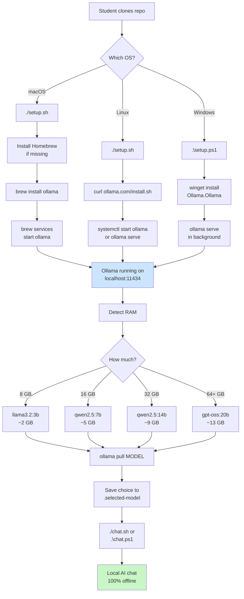
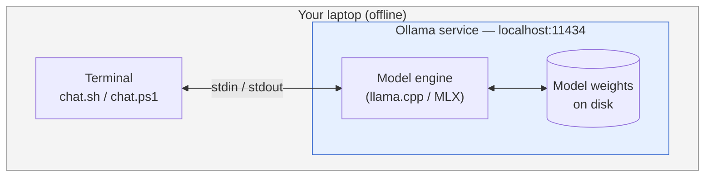

# Run a World-Class AI on Your Laptop

A one-command setup for running a serious AI model fully on your own computer. No cloud, no API keys, no subscription. Your data never leaves your machine.

> **New here?** Pick the right starting point for you:
> - **Not sure what this is FOR?** → [USE-CASES.md](./USE-CASES.md) (five real small-business owners, their real Mondays)
> - **Running a live session?** → [PRE-CLASS.md](./PRE-CLASS.md) · [IN-CLASS.md](./IN-CLASS.md) · [POST-CLASS.md](./POST-CLASS.md) · `./session-day-check.sh` 10 min before class
> - **Want to see real outputs before you install?** → [examples/](./examples/) (six real model runs, unedited)
> - **Beginner, never run a local model?** → [WALKTHROUGH.md](./WALKTHROUGH.md) (step-by-step with diagrams)
> - **Teaching a session?** → [VIDEO-SCRIPT.md](./VIDEO-SCRIPT.md) + [CHEATSHEET.md](./CHEATSHEET.md) ([PDF](./cheatsheet/cheatsheet.pdf))
> - **Want to see what's pre-installed?** → [SKILLS.md](./SKILLS.md) (15 bundled Claude Code skills + `./ai` dispatcher)
> - **Just want to start using it?** → `./preflight.sh && ./setup.sh && ./ai`

---

## The whole picture



---

## Runtime architecture

What's actually running after setup finishes:



No network calls after the one-time model download. Ollama binds only to `localhost`, so nothing is exposed to your wifi or the internet.

---

## Requirements

- macOS, Linux, or Windows 10/11
- 8 GB RAM minimum (16 GB+ recommended)
- 5–15 GB of free disk space for the model

---

## Quick start

### macOS / Linux

```bash
git clone https://github.com/danielpaulai/Run-Worldclass-computer-locally.git
cd Run-Worldclass-computer-locally
./preflight.sh       # confirms your laptop is ready
./setup.sh           # installs everything
./chat.sh            # start chatting
```

### Windows (PowerShell)

```powershell
git clone https://github.com/danielpaulai/Run-Worldclass-computer-locally.git
cd Run-Worldclass-computer-locally
.\preflight.ps1
.\setup.ps1
.\chat.ps1
```

> If PowerShell blocks the script, run this once:
> `Set-ExecutionPolicy -ExecutionPolicy RemoteSigned -Scope CurrentUser`

First run downloads the model (one-time). After that, `chat.sh` / `chat.ps1` is instant.

---

## Model chosen automatically

| Your RAM | Model installed | Size on disk |
|---|---|---|
| 8 GB   | `llama3.2:3b`  | ~2 GB  |
| 16 GB  | `qwen2.5:7b`   | ~5 GB  |
| 32 GB  | `qwen2.5:14b`  | ~9 GB  |
| 64 GB+ | `gpt-oss:20b`  | ~13 GB |

Want a different model? `ollama pull <model-name>` any time.

---

## Chat commands

Inside the chat:

- Type a message, hit enter.
- `/bye` — exit.
- `/?` — show all built-in commands.
- `/set system "You are a ..."` — set a system prompt.

---

## Let Claude Code drive the install

If you use [Claude Code](https://claude.com/claude-code), you don't even need to run the scripts yourself. Open Claude Code and say:

> "Set up this repo on my machine: https://github.com/danielpaulai/Run-Worldclass-computer-locally"

Claude Code reads `CLAUDE.md` and runs the right installer for your OS.

---

## Uninstall

```bash
./uninstall.sh       # macOS / Linux
.\uninstall.ps1      # Windows
```

Removes Ollama, every downloaded model, and the state file.

---

## FAQ

**Why not use Claude Code directly with a local model?**
Claude Code speaks Anthropic's API format; Ollama speaks its own. Bridging them needs a proxy and adds failure modes with no real payoff. This setup keeps things simple: one runtime, one model, one command.

**Does my data leave my computer?**
No. Everything runs locally. Ollama listens only on `localhost:11434`.

**Can I use this with VS Code / Cursor / other editors?**
Yes. Ollama exposes an OpenAI-compatible API at `http://localhost:11434/v1`. Point any OpenAI-compatible client at it with the model name you installed.

**Something went wrong. What do I check?**
- `curl http://localhost:11434/api/version` — should return JSON.
- `ollama list` — shows which models are downloaded.
- Re-run `./setup.sh` (or `.\setup.ps1`) — it's idempotent.
