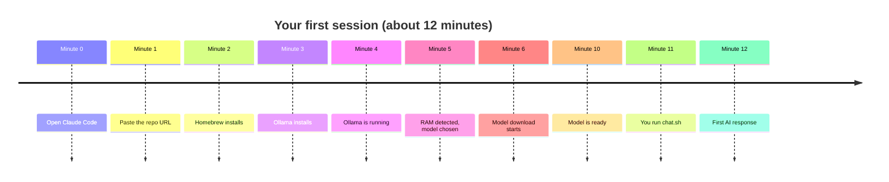
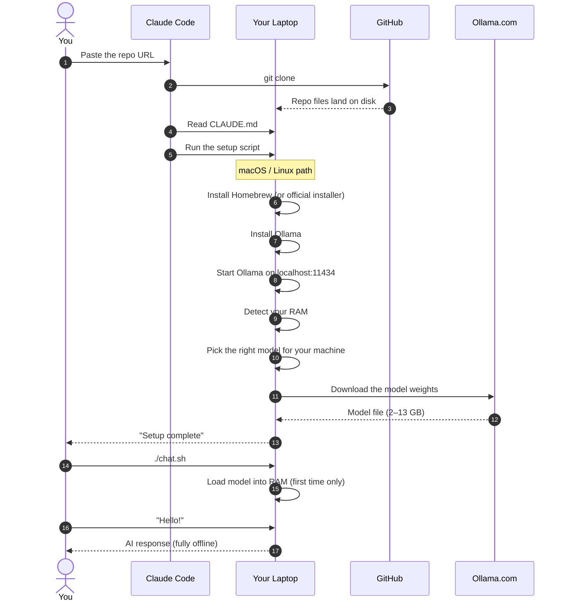
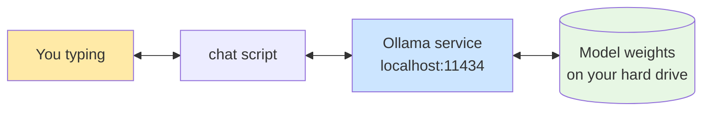

# What Your Session Will Look Like

A step-by-step walkthrough for complete beginners. No prior terminal or coding experience needed.

**Total time:** 10–15 minutes. Most of it is the computer downloading things — your actual work is about 2 minutes.

---

## The 60-second version



---

## What you see vs. what the computer does



---

## Step-by-step

### Step 1 — Open Claude Code  ·  30 seconds

Launch the Claude Code app. You'll see a chat-style input box.

If you don't have it yet, download from [claude.com/claude-code](https://claude.com/claude-code). One installer, no setup.

### Step 2 — Paste one line  ·  30 seconds

Paste this into Claude Code and press enter:

> Set up this repo on my machine: https://github.com/danielpaulai/Run-Worldclass-computer-locally

Claude Code will clone the repo, read `CLAUDE.md` (the file that tells it what to do), detect your operating system, and start the right installer.

### Step 3 — Tools install  ·  2–3 minutes

You'll see output like this:

```
==> macOS detected
[ok] Homebrew installed
==> Installing Ollama
[ok] Ollama installed
==> Starting Ollama
[ok] Ollama is running at http://localhost:11434
```

You may be asked for your computer password once — that's normal, it's for installing software.

### Step 4 — Hardware check  ·  instant

```
==> Detected 16 GB RAM -> choosing model: qwen2.5:7b
```

The script reads your RAM and picks a model that will run smoothly. More RAM means a smarter model.

| Your RAM | Model chosen | Size |
|---|---|---|
| 8 GB   | `llama3.2:3b`  | ~2 GB  |
| 16 GB  | `qwen2.5:7b`   | ~5 GB  |
| 32 GB  | `qwen2.5:14b`  | ~9 GB  |
| 64 GB+ | `gpt-oss:20b`  | ~13 GB |

### Step 5 — Model downloads  ·  5–10 minutes

The longest step. Walk away, grab coffee.

```
==> Downloading qwen2.5:7b. First time only.
pulling manifest
pulling 30e51a7cb1cf:  45% ████████    2.1 GB / 4.7 GB
```

If your wifi hiccups, the download resumes automatically.

### Step 6 — Chat  ·  instant

```
--------------------------------------------------
  Setup complete.

  Chat with your local AI:
      ./chat.sh
--------------------------------------------------
```

Ask Claude Code to run `./chat.sh`, or open a Terminal and run it yourself.

**The first response takes 15–30 seconds** while the model loads into RAM. After that, responses feel as fast as ChatGPT. The model stays loaded for the rest of your session.

---

## What's running after setup



- Your messages **never leave your computer**.
- **No internet** required once the model is downloaded.
- The model file sits on your hard drive. Remove it anytime with `./uninstall.sh`.

---

## Common hiccups

| What you see | Why it's happening | What to do |
|---|---|---|
| "command not found: brew" | Homebrew install paused | Re-run `./setup.sh`, it's idempotent |
| Download frozen at 0% | Network issue | Ctrl-C, re-run — it resumes |
| "No space left on device" | Disk too full | Free up space, re-run |
| "Only 4 GB RAM detected" | Laptop is underpowered | Minimum is 8 GB. Consider a cloud option. |
| First chat response is slow | Model loading into RAM | Normal — only the first response. |

---

## When you're done

Just close everything. Ollama sits quietly in the background using almost no resources.

- **To chat again later:** `./chat.sh` (it's instant — model is already installed).
- **To stop Ollama completely:**
  - macOS: `brew services stop ollama`
  - Linux: `sudo systemctl stop ollama`
  - Windows: stop the Ollama tray app
- **To remove everything:** `./uninstall.sh` (or `.\uninstall.ps1` on Windows).

---

## What you've learned by the end of the session

- How to install and run a local AI model
- What Ollama is and why it matters for privacy
- That your laptop is powerful enough to run a serious AI on its own
- How to swap in different models with `ollama pull <name>`

Welcome to local AI.
